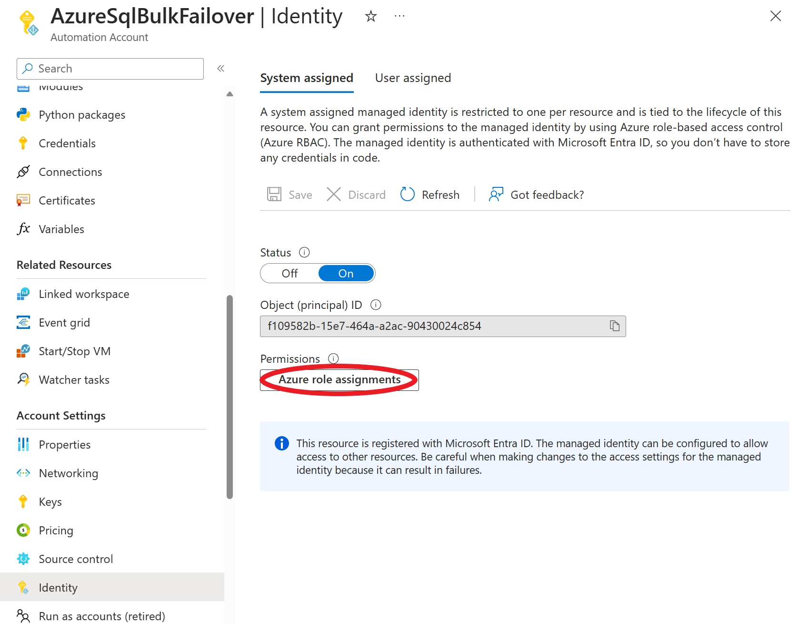
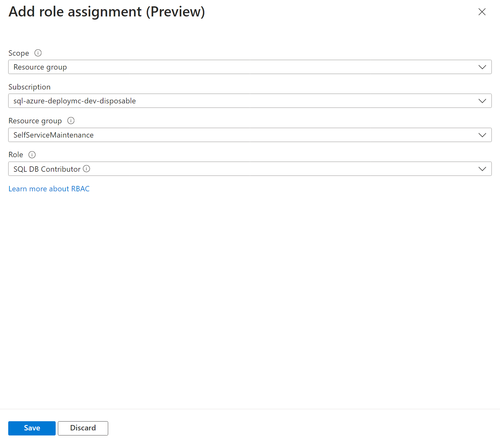
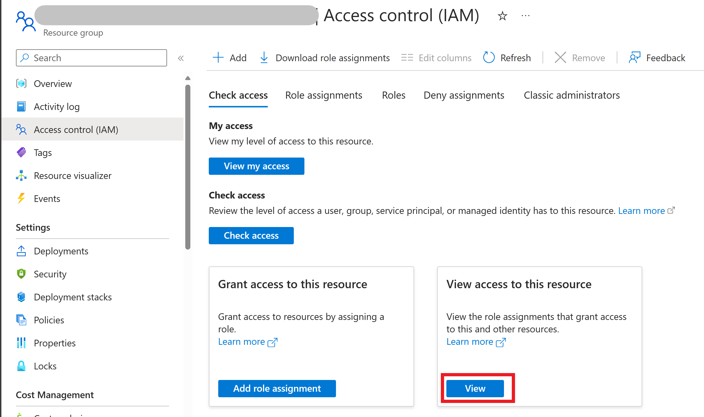
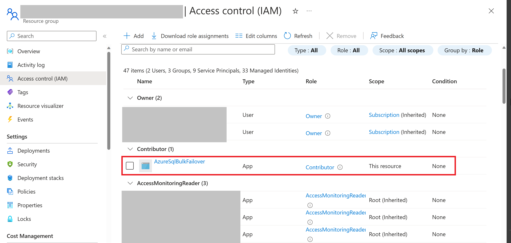

The automation account that was created during deployment (AzureSqlBulkFailover) needs permissions to access the databases that it needs to failover. This can done by assigning the automation accounts managed identity the "Contributor" role for the resource group that contains the databases.
To do this, follow these steps:
1. Log in to the Azure portal https://portal.azure.com.
2. Select the automation account that was created during deployment (AzureSqlBulkFailover). You can do this by entering "_AzureSqlBulkFailover_" in the search bar at the top of the page. Note that you want the Automation Account resource, not the Runbook resource with a similar name "AzureSqlBulkFailoverRunbook".
3. Select the **Identity** tab and click the **+ Add role assignment** button.

4. Select the scope, subscription, resource group and role you want to assign. In this case, select the subscription that contains your databases, the resource group that contains your databases, and the "SQL DB Contributor" or "Contributor" role. Note that the contributor role will give the runbook permissions to do more than just failover databases. If you want to limit the permissions to just failover of database, select the "SQL DB Contributor" or even less privileged role See [Managed-Instance User Initiated Failover](https://learn.microsoft.com/en-us/azure/azure-sql/managed-instance/user-initiated-failover?view=azuresql). Note that if you need to failover pools, then the runbook needs "Contributor" role on the pool resource. You can also create a custom role with just the permissions you want. See [Custom Roles](https://docs.microsoft.com/en-us/azure/role-based-access-control/custom-roles) for more information.

5. Click the **Save** button.
6. Repeat steps 3-5 for each subscription that contains databases that you want the runnbook to be able to failover. Note that when executing the runbook you may only select a single server to failover. However, the runbook will failover all databases and pools on that server and you may use the same runbook to failover servers on different subscriptions or resource groups as long as you have assigned permissions for it to do so.
7. Verify permissions by selecting the resource group that contains your databases and selecting the **Access control (IAM)** tab and then clicking on **View access to this resource**.

You should see the automation account listed with the role you assigned.

Note that when running the runbook with "*" values under server and resource group, it will failover all servers in all resource groups that it has access to.
