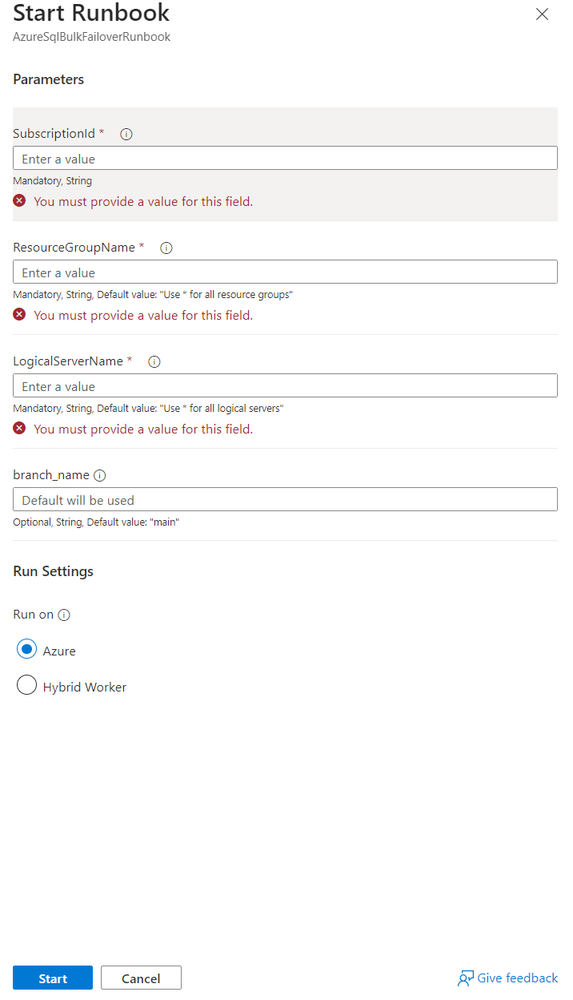
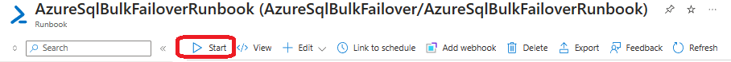
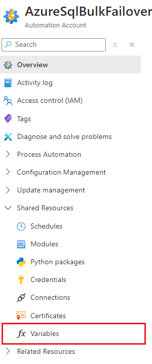
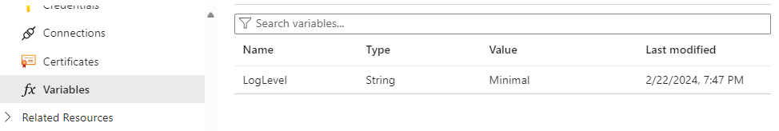
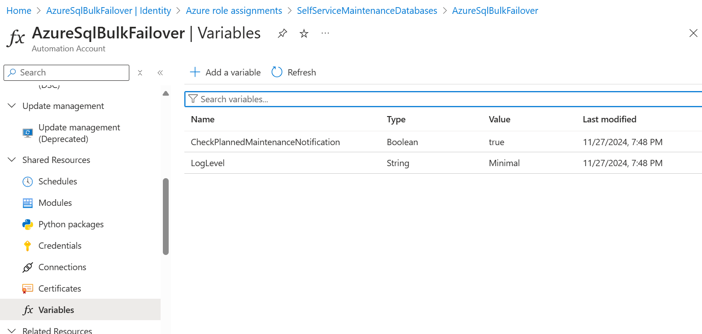

# AzureSqlBulkFailover - Usage

----

# Prerequisites

* You must have [deployed](./AzureSqlBulkFailoverSetup.md) the AzureSqlBulkFailover runbook into the subscription that contains your databases and assigned permissions to the automation account that was created during deployment (AzureSqlBulkFailover).

----

# Usage
:exclamation: **Important:** The runbook only works for SQL DB resources, this solution doesn't support Azure SQL MI resources.

1. Log in to the Azure portal https://portal.azure.com. 
2. Browse to the AzureSqlBulkFailoverRunbook resource. You can do this by entering "_AzureSqlBulkFailover**Runbook**_" in the search bar at the top of the page. Note that you want the Runbook resource, not the Automation Account resource with a similar name "AzureSqlBulkFailover".
3. Click the **Start** button to begin failover process.
   - This will open the parameter entry dialog as shown below:
     > 
   - Enter values for the subscription, resource group and server.
     Warning: if you assign access to the runbook to multiple resource groups and the use the * for the resource group and server name when running it, it will failover all servers in all resource groups where it has access.
   - You may leave the branch name empty unless you have a specific requirement for a custom script execution located on a public branch within the [GitHub](https://github.com/Azure/AzureSqlBulkFailover) repository.
   - Select "run on azure" and click start.
4. To see intermediate output as the process executes, select the output tab and click the **Refresh** button. 
    > 
5. The output will automatically refresh when the operation completes. Look for the message
```
2023-11-13 19:14:03 => Successfully failedover 2 out of 2 resources. Process took: 00:01:34.4271907.

2023-11-13 19:14:03 => All eligible resources failed over successfully.

2023-11-13 19:14:03 => Failover process complete.
```
at the end of the output. This indicates that all databases were upgraded. Ensure that the number of databases failed over is not 0 and corresponds to the number of databases you expected to be failed over.

----
# Logging
The runbook logs all activities to the Azure portal. You can view the logs by clicking the **Output** tab in the runbook resource. It should be noted that the level of logging is set to "Minimal" by default but that it can be changed by modifying the global automation accounts "LogLevel" variable as shown in the following image. Valid values for this variable are "Minimal", "Info" and "Verbose".
> 
> 

# Check for Maintenance Notifications
The runbook can check for maintenance notifications before proceeding with the failover process. This feature is enabled by default but can be disabled by modifying the global automation accounts "CheckForMaintenanceNotifications" variable as shown in the following image.

Valid values for this variable are "True" and "False".
