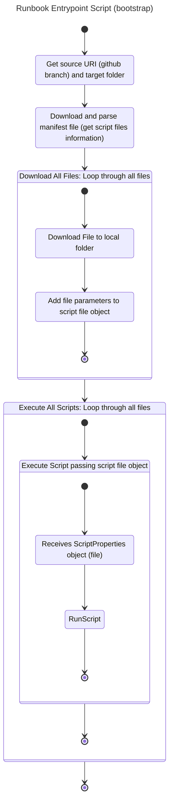

# RunbookEntrypoint.ps1

This PowerShell script is designed to download and execute a series of scripts from a remote location, passing in the required parameters for each script.

## Usage

To use this script, you will need to provide the following parameters:

- `$SubscriptionId`: The ID of the Azure subscription to use.
- `$ResourceGroupName`: The name of the resource group to use.
- `$ServerName`: The name of the logical server to use.

Here's an example of how to run the script:

```powershell
.\RunbookEntrypoint.ps1 -SubscriptionId "12345678-1234-1234-1234-123456789012" -ResourceGroupName "MyResourceGroup" -ServerName "MyLogicalServer"
```

## Functionality

The script performs the following steps:

1. Downloads a manifest file (`RunbookEntrypointManifest.json`) from a remote location.
2. Parses the manifest file to get a list of files to download and execute.
3. Downloads each file to a local directory and adds script parameter values to each.
4. Executes each file in turn, passing in the script file (with its paramameter values) to each.

## Functions

The script includes the following functions:

### `Get-AllFiles`

This function gets all files listed in the manifest file and adds the local file path to the file object.

### `Get-File`

This function gets a single file from a remote location.

## Variables

The script uses the following variables:

- `$remoteRootUri`: The root URI of the remote location to download files from.
- `$localRootPath`: The local directory to download files to.
- `$allFiles`: An array of file objects, each representing a file to download and execute.
- `$scriptsToExecute`: An array of file objects, each representing a script to execute.
- `$scriptNum`: A counter for the number of scripts executed.

## Loop

The script uses a `foreach` loop to iterate over the `$scriptsToExecute` array and execute each script in turn. For each script, the loop outputs a message indicating which script is being executed, and then uses the call operator (`&`) to invoke the script. The script is invoked with the single named parameter (`ScriptProperties`) that are passed to the script to be executed as an argument. It is up to each script to exctract the specific parameters it needs from the ScriptProperties object.


 
## Notes

- This script requires PowerShell version 3.0 or later.
- This script assumes that the manifest file is named `RunbookEntrypointManifest.json` and is located in the `Source` directory of the remote location.
- This script assumes that each script listed in the manifest file has a corresponding `.ps1` file extension.
- In the current implementation, all script files receive the File and Execute parameters from the RunbookEntryPointManifest.Json file and SubscriptionID, ResourceGroupName, and ServerName are added to those during execution based on user selections when deploying the template.
- Aditional parameters may be passed to a script by inserting them in the RunbookEntrypointManifest.json file.
- It is up to each script to extract the parameter values and use them as required. For example, the following code snippet extracts the `SubscriptionId`, `ResourceGroupName` and `LogicalServerName` parameters from the `ScriptProperties` object that is passed to it on execution:

```powershell
    # Get the input parameters    
    [string]$SubscriptionId = $ScriptProperties.SubscriptionId;
    [string]$ResourceGroupName = $ScriptProperties.ResourceGroupName;
    [string]$LogicalServerName = $ScriptProperties.ServerName;
 ```